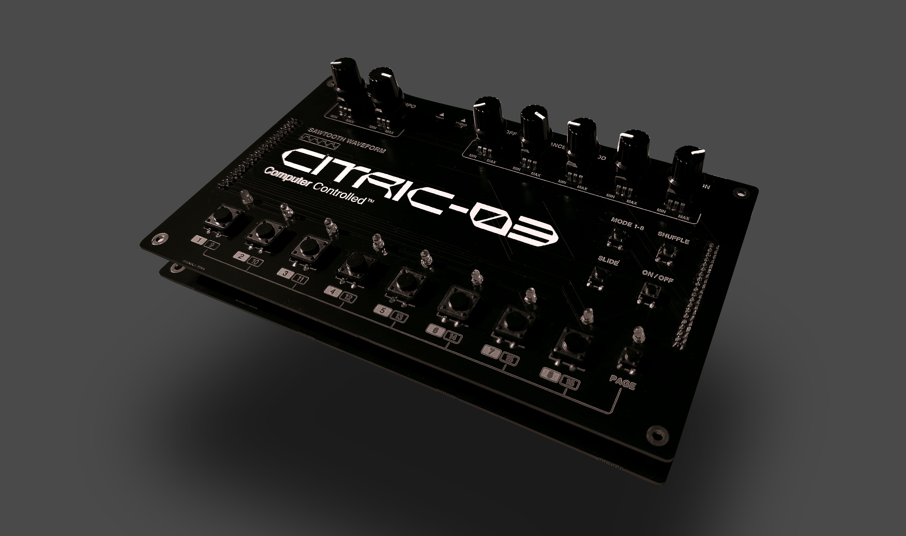

# Citric-03: A TB-303 Inspired Bassline Sequencer

## Overview
Citric-03 is a "dumbed-down" version of the iconic TB-303 bassline sequencer, built from scratch for the Daisy Seed platform. This project aims to recreate the essence of the classic 303 sound and sequencing capabilities in a modern, customizable format.

[Link to video]([https://yourvideolink.com](https://vimeo.com/1008383645?share=copy))

## Features
- 16-step sequencer
- Saw wave oscillator with resonant low-pass filter
- Envelope modulation for classic acid sounds
- Slide and accent functionality
- Multiple play modes (forward, backward, ping-pong, random)
- Real-time parameter control via potentiometers
- LED indicators for active steps

## Prerequisites
Before you begin, ensure you have the following:
- Daisy Seed board
- Necessary electronic components (potentiometers, buttons, LEDs, etc.)
- DaisyExamples repository cloned on your local machine

## Setup
Clone the DaisyExamples repository:
```
git clone https://github.com/electro-smith/DaisyExamples.git
```
Navigate to the `MyFolder` directory within DaisyExamples:
```
cd DaisyExamples/MyFolder
```
Create a new directory for this project and navigate into it:
```
mkdir citric-03
cd citric-03
```
Copy the source files from this repository into the `citric-03` directory.

## Building and Flashing
- Connect your Daisy Seed board to your computer.
- From the `citric-03` directory, build the project:
```
make
```
Flash the compiled program to your Daisy Seed:
```
make program-dfu
```
